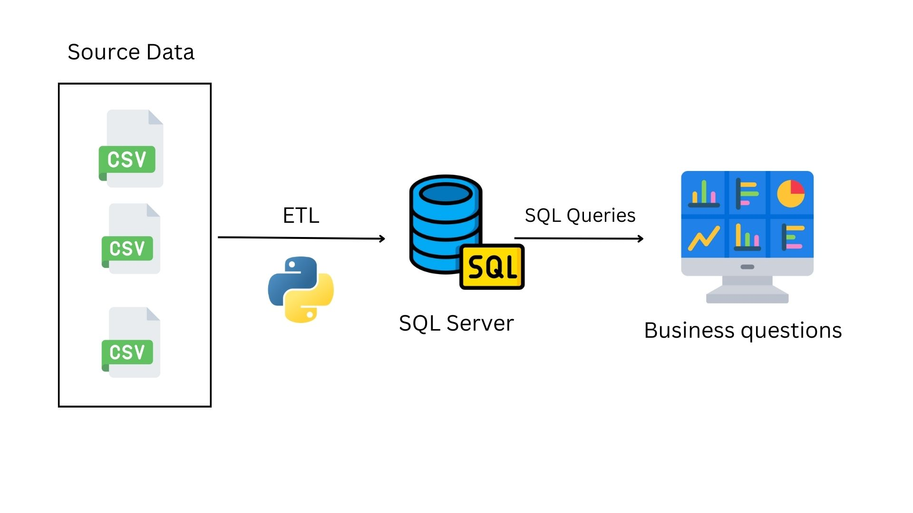

# Airbnb Data Analysis Project

Welcome to the Airbnb Data Analysis Project README! This document serves as a central reference point for understanding the entire project, including the dataset, ETL pipeline, data warehouse schema, and business questions answered. Let's dive into the details:




## Source Data

**Dataset Name**: Airbnb Listings, Reviews, and Calendar Data For Barcelona, Spain

**Description**: This dataset contains comprehensive information about Airbnb listings in Barcelona, including details about properties, host information, availability, reviews, and calendar data. It serves as the foundation for various analyses aimed at understanding pricing trends, property popularity, host behavior, and more.

data source here : http://insideairbnb.com/get-the-data/


## [Airbnb Data Warehouse (DWH)](./2.%20DWH/README.md)

### Schema Overview

The Airbnb Data Warehouse (DWH) schema consists of fact and dimension tables designed to centralize and organize Airbnb's operational data for analytical purposes. Here's an overview:

#### Fact Tables:

1. **calendar_Fact**: Stores availability and pricing information for Airbnb listings.
2. **review_Fact**: Contains data related to guest reviews of Airbnb listings.

#### Dimension Tables:

1. **date_Dim**: Provides date-related attributes for temporal analysis.
2. **listing_Dim**: Stores detailed information about Airbnb listings for contextual analysis.

### Rationale for Choosing Fact and Dimension Tables

Fact tables were chosen based on their representation of key operational aspects of Airbnb's data, while dimension tables provide context and descriptive attributes for analysis.

## [ETL Pipeline](./3.%20ETL%20Pipeline/README.md)

The ETL (Extract, Transform, Load) pipeline extracts data from the staging layer in SQL Server, performs necessary transformations using Python, and loads the transformed data into a SQL Server database. The pipeline involves the following steps:

1. **Extract**: Data is extracted from the staging layer in SQL Server, including tables such as `calendar`, `listings`, and `reviews`.

2. **Transform**: Python and pandas are used to perform transformations, including date dimension table creation, cleaning and formatting, and filtering and column selection.

3. **Load**: Transformed data is loaded into the destination SQL Server database (`Airbnb_DWH`) using SQLAlchemy.
## [Business Questions](./4.%20Business%20Questions/README.md)

This section provides answers to specific business questions based on the Airbnb Data Warehouse (DWH) after the ETL process and modeling. Each question is answered using SQL queries against the DWH tables, covering various aspects such as listing availability, pricing, reviews, and neighborhood analysis.

Example of the analysis:
Question: 
### Q.4: Recommendations for Vacationers

#### For a Man with His Wife and 2 Children Looking for a Week Vacation around March 2024:
```sql

with AvailableDays as (

  select c.listing_id ,  d.date , ROW_NUMBER() over(partition by c.listing_id order by d.date ) as row_num
  from calendar_Fact c
  join date_Dim d
  on d.date_key = c.date_key
  where d.month = 3 and d.year = 2024 and c.available='t'
),
ConsecutiveDays as(
select 
	listing_id ,
	min(date) as start_date,
	max(date) as end_date,
	count(*) as num_available_days
from AvailableDays 
group by listing_id
)
select top 3 cd.listing_id , name , num_available_days , accommodates,  price
from ConsecutiveDays cd
join listing_Dim l 
on l.listing_id = cd.listing_id
where num_available_days >= 7 and accommodates >= 4 AND name LIKE '%2 bedrooms%4 beds%'
order by price , start_date ,num_available_days desc;

## Conclusion

The Airbnb Data Analysis Project README provides a comprehensive overview of the project, from data extraction and transformation to schema design and business question answers. It serves as a guide for understanding the project's objectives, methodologies, and outcomes.
